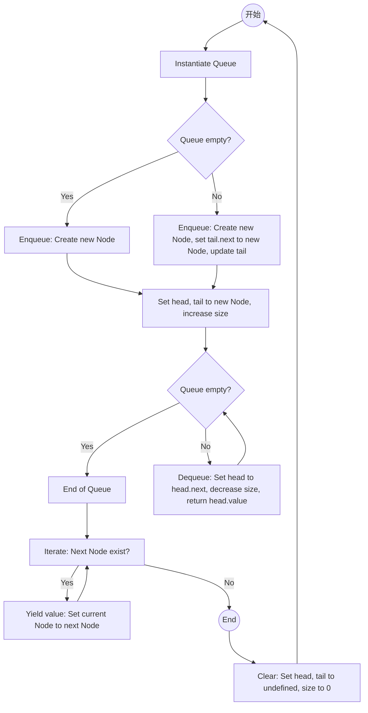

# [yocto-queue](https://www.npmjs.com/package/yocto-queue): <Badge github="https://github.com/sindresorhus/yocto-queue" npm="yocto-queue" />

如果你在一个大型数组上执行 push、shift 的操作，那么你应该使用这个模块。因为它的性能比 Array 要好。

### 流程图

